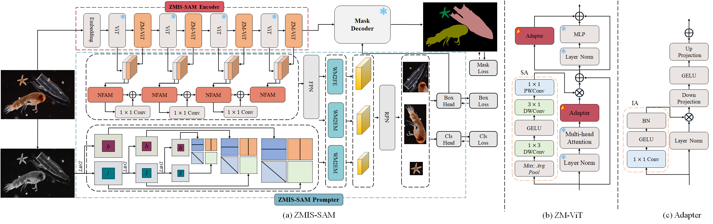
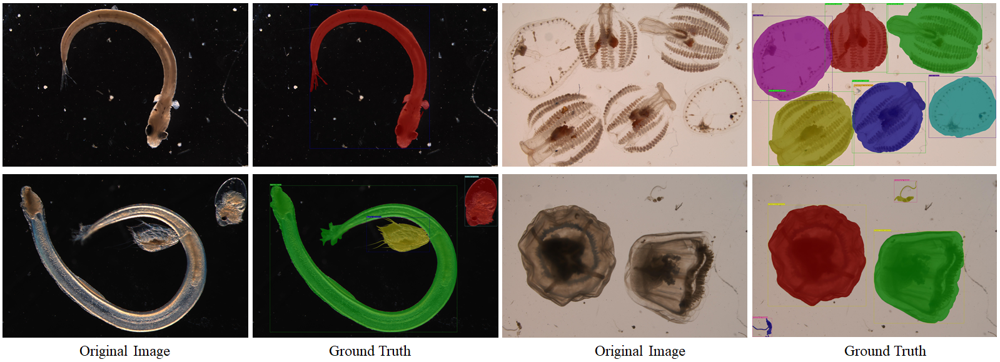

# ZMIS-SAM: Zooplankton Marine Instance Segmentation with SAM

ZMIS-SAM adapts the [Segment Anything Model (SAM)](https://segment-anything.com/) for fine-grained instance segmentation of marine zooplankton. It uses a frozen SAM ViT-Huge backbone with lightweight adapters and a Mask R-CNN–style detection head, enabling precise detection and segmentation of 48 zooplankton categories.



## Dataset: ZMIS5K

ZMIS5K contains 5,000 microscopic zooplankton images across 48 species, annotated in COCO format with bounding boxes and instance masks.



<details>
<summary>48 Categories</summary>

`_background_`, Calanus sinicus, Sagitta crassa, Themisto gracilipes, Penilia avirostris, Centropages abdominalis, Acartia pacifica, Centropages tenuiremis, Pontellopsis tenuicauda, Calanopia thompsoni, Sugiura chengshanense, Ophioplutues larva early, Eirene menoni, Macrura larva, Evadne tergestina, Muggiaea atlantica, Paracalanus parvus, Oithona plumifera, Pleurobrachia globosa, Clytia folleata, Obelia dichotoma, Ectopleura bimanatus, Dolioletta gegenbauri, Oikopleura longicauda, Tornaria larva, Polychaeta larva early, Polychaeta larva later, Turritopsis nutricula, Proboscidactyla flavicirrata, Fritillaria formica, Labidocera rotunda, Alima larva, Megalopa larva, Brachyura zoea larva, Ophioplutues larva later, Fish eggs, Fish larva, Actinotrocha larva, Trochophora larva, Bougainvillia muscus, Aequorea conica, Varitentaculata yantaiensis, Porcellana zoea larva, Acetes larva, Centropages dorsispinatus, Clytia hemisphaerica, Jellyfish larva, Remains

</details>

## Model Architecture

- **Backbone**: SAM ViT-Huge (frozen decoder, pretrained)
- **Adapter**: ZViTAdapters inserted at ViT layers 8–32 (every 2 layers), embed_dim=1280
- **Neck**: ZMISFPN — ZMISFeatureAggregator (multi-layer feature fusion) + ZMISSimpleFPNHead (5-scale output)
- **Detection Head**: RPNHead + ZMISPrompterAnchorRoIPromptHead (Mask R-CNN style)
- **Mask Head**: ZMISPrompterAnchorMaskHead with ZMISSamMaskDecoder

## Installation

```bash
pip install -U openmim
mim install mmengine mmcv mmdet

git clone https://github.com/your-repo/ZMIS-SAM.git
cd ZMIS-SAM
pip install -e .
```

Download SAM ViT-Huge pretrained weights and place them at:
```
pretrain/sam-vit-huge/pytorch_model.bin
```

## Data Preparation

Organize the ZMIS5K dataset as follows:

```
data/
├── train/
├── val/
├── test/
└── annotations/
    ├── train_annotations.json
    ├── val_annotations.json
    └── test_annotations.json
```

Update `data_root` in [configs/zmis_train.py](configs/zmis_train.py#L42) to your local path.

## Training

```bash
# Single GPU
python tools/train.py configs/zmis_train.py

# Multi-GPU (e.g., 4 GPUs)
bash tools/dist_train.sh configs/zmis_train.py 4
```

Key training settings ([configs/zmis_train.py](configs/zmis_train.py)):

| Setting | Value |
|---|---|
| Input size | 512 × 512 |
| Epochs | 400 |
| Optimizer | AdamW (lr=2e-4, wd=0.05) |
| LR schedule | Linear warmup + Cosine annealing |
| Precision | AMP float16 |
| Batch size | 2 per GPU |

## Evaluation

```bash
# Single GPU
python tools/test.py configs/zmis_train.py <checkpoint> --eval bbox segm

# Multi-GPU
bash tools/dist_test.sh configs/zmis_train.py <checkpoint> 4
```

Metrics reported: COCO bbox mAP and segm mAP.

## Acknowledgements

This project builds on [MMDetection](https://github.com/open-mmlab/mmdetection) and [Segment Anything Model](https://github.com/facebookresearch/segment-anything).
